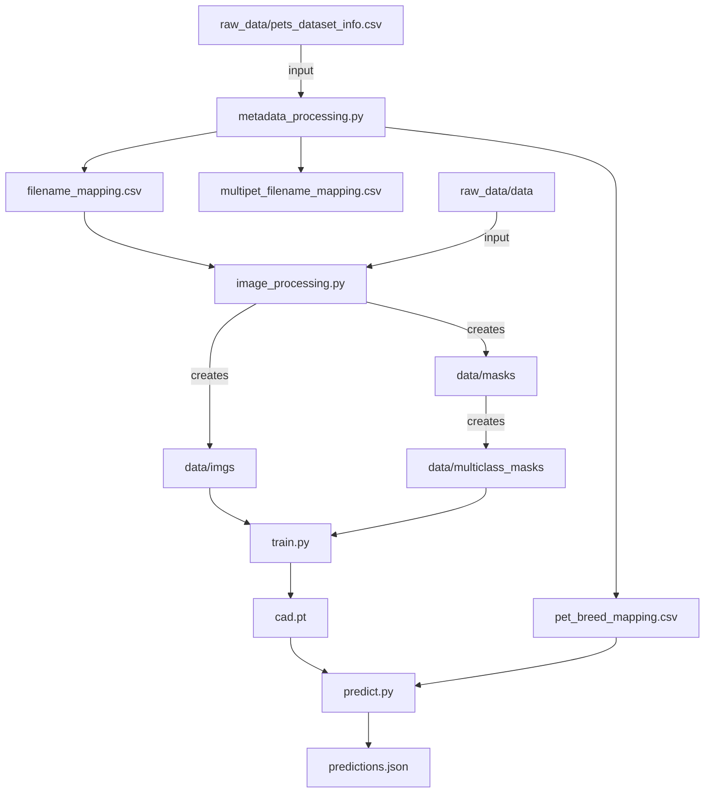

# Cats & Dogs

## Data
https://github.com/harrison-ai/hai-tech-tasks/releases/download/v0.1/cats_and_dogs.zip

## Code
The PyTorch model code was from https://github.com/milesial/Pytorch-UNet. <br>
Modifications were made to get it running with the cats and dog dataset. More details in the notes section. <br>
The novel code created are the following:
```
src/preprocessing/image_processing.py
src/preprocessing/metadata_processing.py
src/model/utils/predict_utils.py
```

## Setup
Considering `cats_and_dogs` as root directory, create and unzip the cats and dog data file into a folder called `raw_data`. <br>
Filestructure should look like below:

```
cats_and_dogs
├── raw_data
│    ├──pets_dataset_info.csv
│    ├──data
│        ├── 0a0bd47c-9271-5b2b-b039-04ff0b596890
│                ├── image.jpg
│                ├── mask.jpg
│        ├── 0a5ca7c4-a46d-5d4b-8701-6377b5427e26
│        ├── 0a5e06c8-a443-550e-b026-b7a372f03a68
│        ├── ...
│     
|
└── src
│    ├── model
│    ├── preprocessing 
│    ├── requirements.txt
|
├─ Makefile
├─ README.md

```
## Get Started
- Set up the python virtualenv: `make python-env`
- Run tests: `make python-test`
- Run the preprocessing tasks:
    - Metadata: `make process-metadata`
    - Images: `make process-image`
- Train model: `make model-train`
- Sample model inference: `make model-inference-example`

## Application Dataflow


## Notes
### Modelling
Initial idea was to use U-Net for only masking and have one or two models for the classification tasks. This would take image as input, split to parallel models and then gathering all results:
1. Classification model with three categories `[cat, dog, both]`
2. Object detection model for all breeds (maybe something like YOLO?)
3. Image segmentation model for masking (U-Net, Mask R-CNN)

Reading through the requirements again and getting deeper into U-Net model, think its possible to just use U-Net for all three tasks by treating this as a multiclass image segmentation problem. <br>
The approach is as follow:
- Process metadata file to create a unique integer mapping for each breed.
- Convert existing greyscale mask into multiclass mask by replacing the 8 bit values to the breed integer mapping from the metadata file.
- Create a training set which is a subset of the full dataset where only single pet is present. 
- Train the U-Net model on 38 classes (background + 37 breeds) with the training dataset.
- Get mask prediction for 38 classes
    - Binary mask: Change all none 0 values to 1
    - Breeds: Get percentage of pixel contribution for particular breed, using heuristic to threshold (>20% of pixels in image).
    - Species: Map breed prediction back to species using set membership.

### Metadata processing - `/src/preprocessing/metadata_processing.py`
This script parses the metadata csv file (`pets_dataset_info.csv`) and does the following:
- Creates the `pet_breed_mapping.csv`, containing the breed name and integer mapping.
```
Abyssinian,1
Bengal,2
Birman,3
```
- Creates the `filename_mapping.csv`, containing the filename and integer mapping for images with only a single pet.
```
e23e7fba-cdcf-59fc-b6e1-3dbae82c3f36,32
bd3703af-9e60-5667-a6ca-e4f5a71e319b,32
e1a0b2fa-5b34-565b-9f64-96704101804c,25
```
- Creates the `multipet_filename_mapping.csv`, contains the filename and integer mapping for images with multiple pets.
```
dd9e09f2-8d78-5bcb-8873-d52c6ed83d1b,"[8, 23]"
faa44a9a-ce5c-53ba-b9fc-3bb3f5aa21ea,"[12, 28]"
c4f3481e-194f-5c82-80a7-9897c7f46ce9,"[11, 14]"
```
Also included some basic checks to ensure the distribution of breeds for the single pet dataset was balanced.
It was found that for the single pet images most breeds had around 200 images with max of 200 and minimum of 184 images for each breed.

### Image processing - `/src/preprocessing/image_processing.py`
Using the single pet filename mapping file as input, this script does the following:
- Creates three new directories: `data/imgs , data/masks, data/multiclass_masks`
- Rename and copy only the single pet images to `data/imgs`
- Rename and copy only the single pet masks to `data/masks`
- Using the mapping file, conver the greyscale mask to multiclass mask and save to `data/multiclass_masks`
- Delete the images and masks containing 4 channels instead of 3.

Issue with using `pil.image.point` for thresholding where the result `jpg` file would contain random values. Spent way too long trying to figure this out thinking it was a data type problem.
Finally figured out that it was PIL doing lossy compression when saving as `jpg`, converting to `png` solved the problem.

### Model Training - `/src/model/train.py`
Using most of the same code from https://github.com/milesial/Pytorch-UNet, some minor changes and modifications below:
- Using BasicDataset class instead of the Carvana (Kaggle competition?) class.
- Hard-coded image resize value to (300,300) in the `preprocess` method for the Dataset class. In the original Carvana dataset, all images were same size so rescaling was used.
- Removed redundant code such as Weights and Biases for model training logs.
- Default model args such as number of classes changed to 38.

Issue with training loop where an image had 4 channels(included an alpha channel) instead of expected 3 channels. Solved by creating function in the Image processing code to find the offending images and deleting them along with the masks.
```
3e3f9a88-b923-5b94-a16a-4371363b7518.jpg
5d03377b-7587-5e0a-8587-51da73733ef3.jpg
a4e8e1ae-6184-52a0-84b8-318db5aeb263.jpg
```
### Model Inference
Most of the code are same, some new functions were added in `utils/predict_utils.py`
- Load model parameters 
- Predict on image
- Convert predicted mask to binary mask
- Convert predicted mask to breed pixel count
- Convert breed pixel count to percentage 
- Filter on the percentage to get breed prediction
- Map breed to species

## Additional Questions
**a. Expose a REST API and integrate your predictive model into a backend system.** <br>
The output is already in a JSON format so should not be hard to refactor into a fast API + Pydantic implementation for REST API. <br>
I think the flow would be:
```
User -> Frontend -> Upload to S3 -> S3 Event -> Some Queue or directly to Inference service -> Frontend -> User.
```
**b. Cater for images with more than 2 cats and dogs of all combinations of all breeds of pets we have seen in this dataset.** <br>
The implementation should be sound for this since the model predicts a breed for each pixel. What would need to change is likely function/algo to determine if a group of pixel is a breed since we would expect the percentage pixel for each pet be lower if more pets are in a single picture.

**c. Scale your service to meet ~8,000 requests per second.** <br>
This would depend on the throughput required I think, for the images here it's likely you could just use Lambda as compute since the forward step in the neural network can be done quite fast on CPU and the model artifact is only ~100MB in size and could be baked into a Lambda Container Image.  <br>
Otherwise, the trusty ECS + Load Balancer with auto-scaling policies could be used. <br>
For better resource utilisation/optimisation, could possibly utilise GPU Time slicing or Multi-Instance GPU from Nvidia.

## Improvements
- Lots of hardcoded filepaths currently, use environment variables instead.
- Convert each step/task into individual docker images.
- Orchestrate using Airflow or similar.
- Data contract/quality check before the model training step and model inference steps. Ensure image size, channels...etc